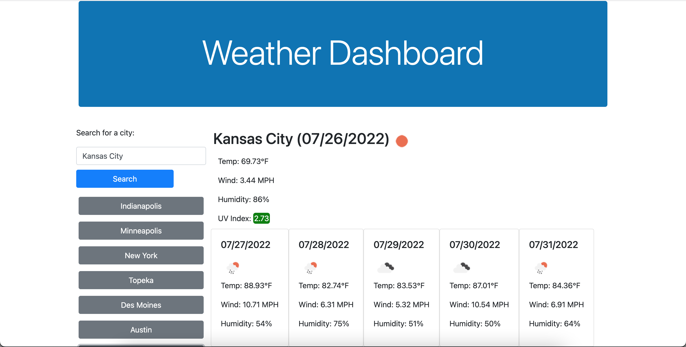

# ryan-weather-dashboard

## Description

The challenge was to make a weather app from scratch using what using what we've learned so far and using the Open Weather API. I got lots of practice looking through the documentation on this weather api. I also used day.js again for the dates and more practice with local storage and dynamically putting things on the page.

## Installation

https://nuglah.github.io/ryan-weather-dashboard/

## Usage

The search bar will take any US city name and if valid will show the current weather for that city with some stats like tempature and uv index after clicking the search button. A five day forecast will also appear showing some stats for the next five days in that city. A history of all your searches will appear under the search bar. You can click on one and it will get that cities weather again.

## Credits

Lots of stack overflow for some of the giant getSearchProps function and lots of googleing.
